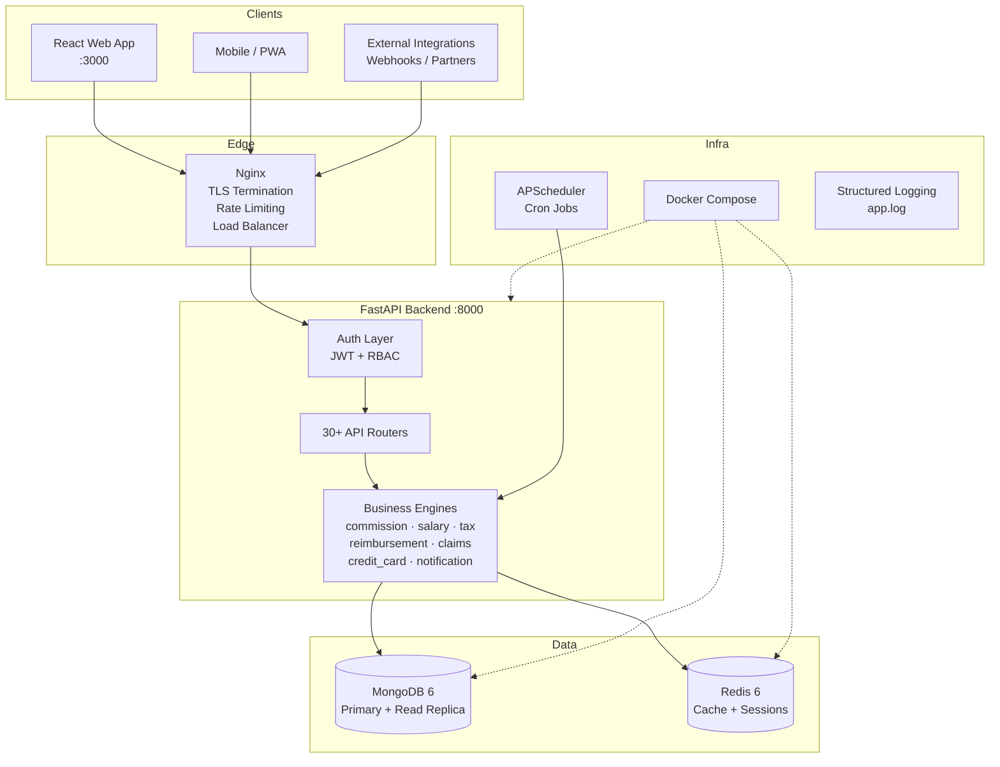
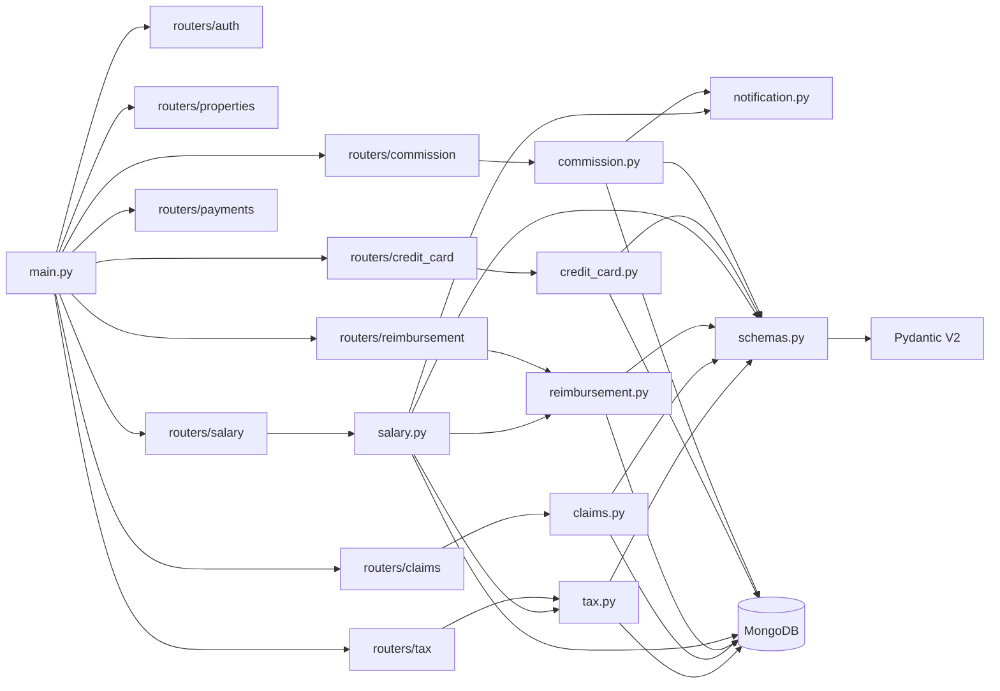
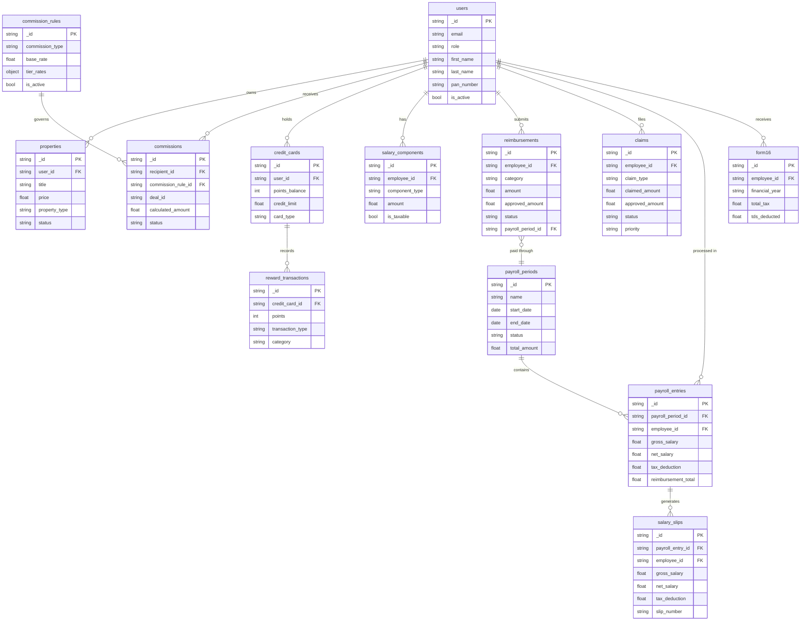
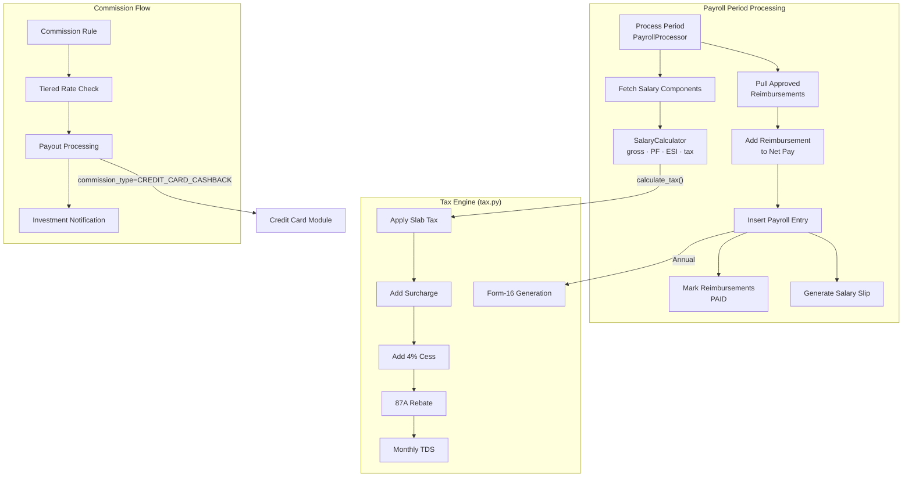
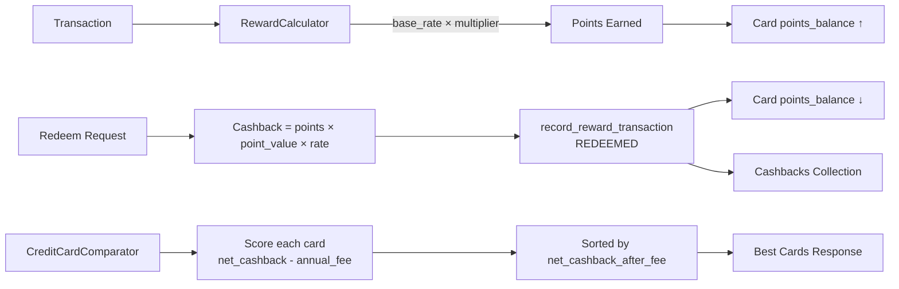
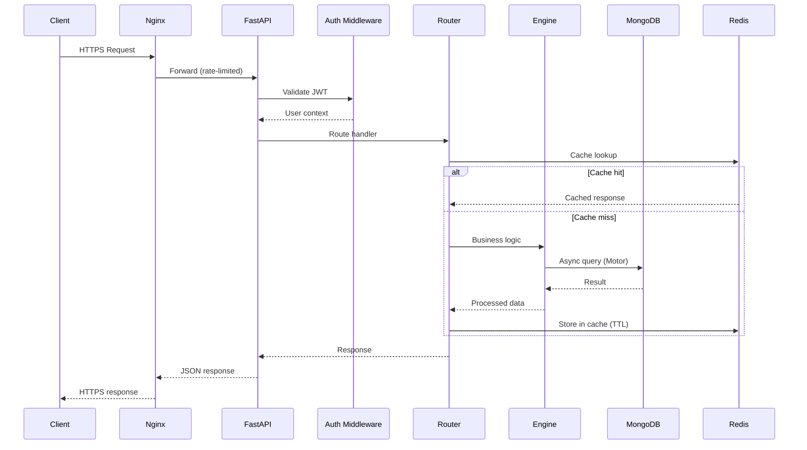
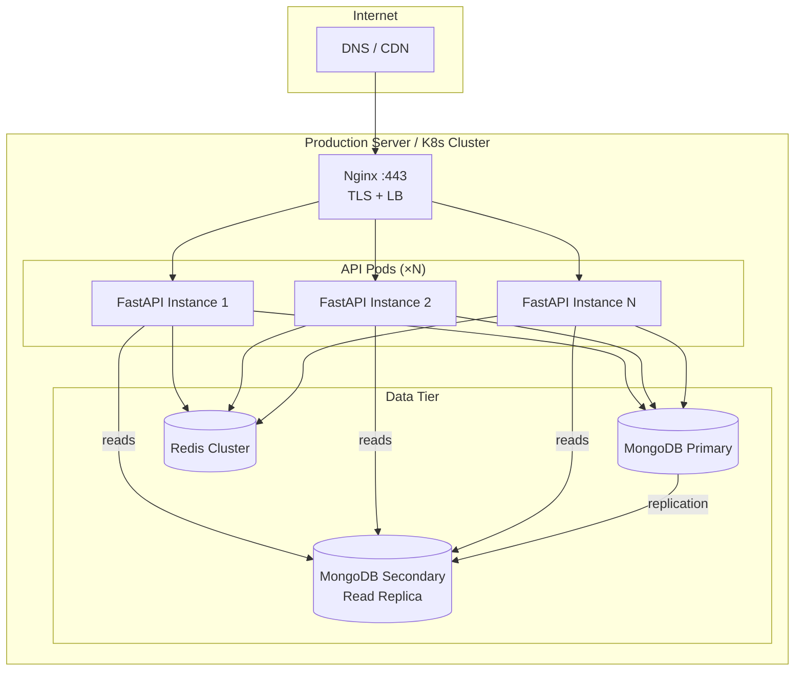

# Architecture — Housing Platform

> All diagrams use [Mermaid](https://mermaid.js.org/) syntax and render natively on GitHub, GitLab, and Notion.

---

## 1. High-Level System Architecture

---

## 2. Backend Module Dependency Map

---

## 3. Data Model — MongoDB Collections

---

## 4. Finance Module Integration

---

## 5. Credit Card Rewards Architecture

---

## 6. Request Lifecycle (Sequence)

---

## 7. Deployment Architecture

