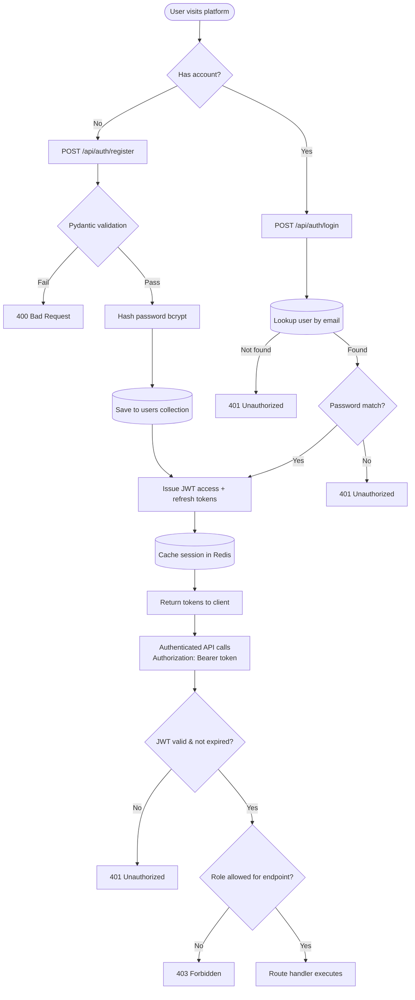
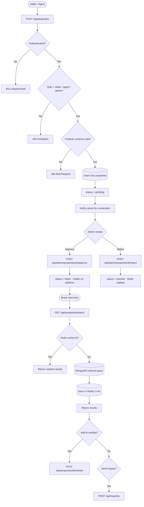
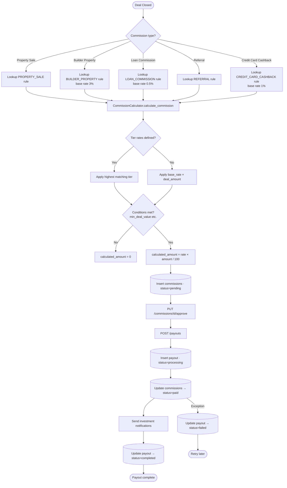
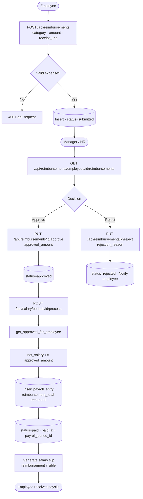
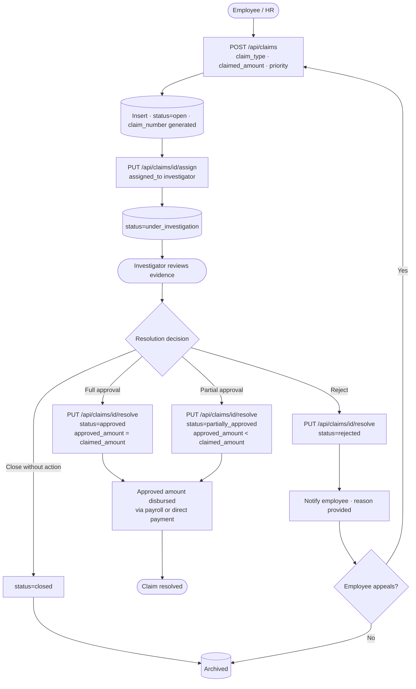
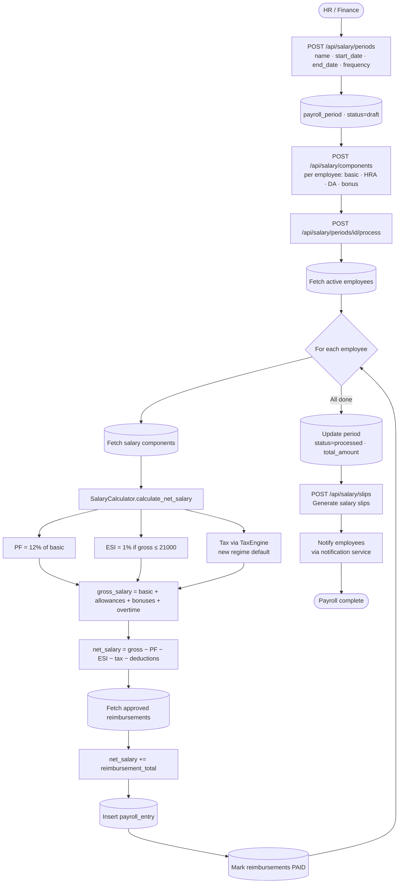
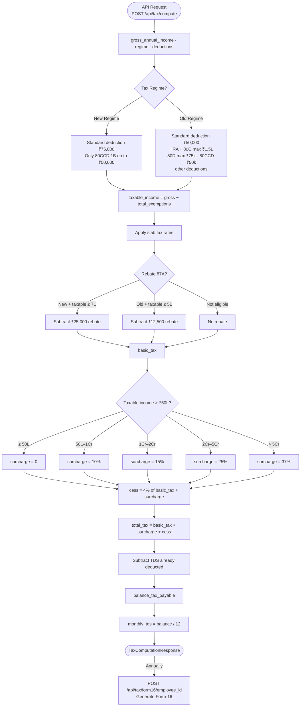
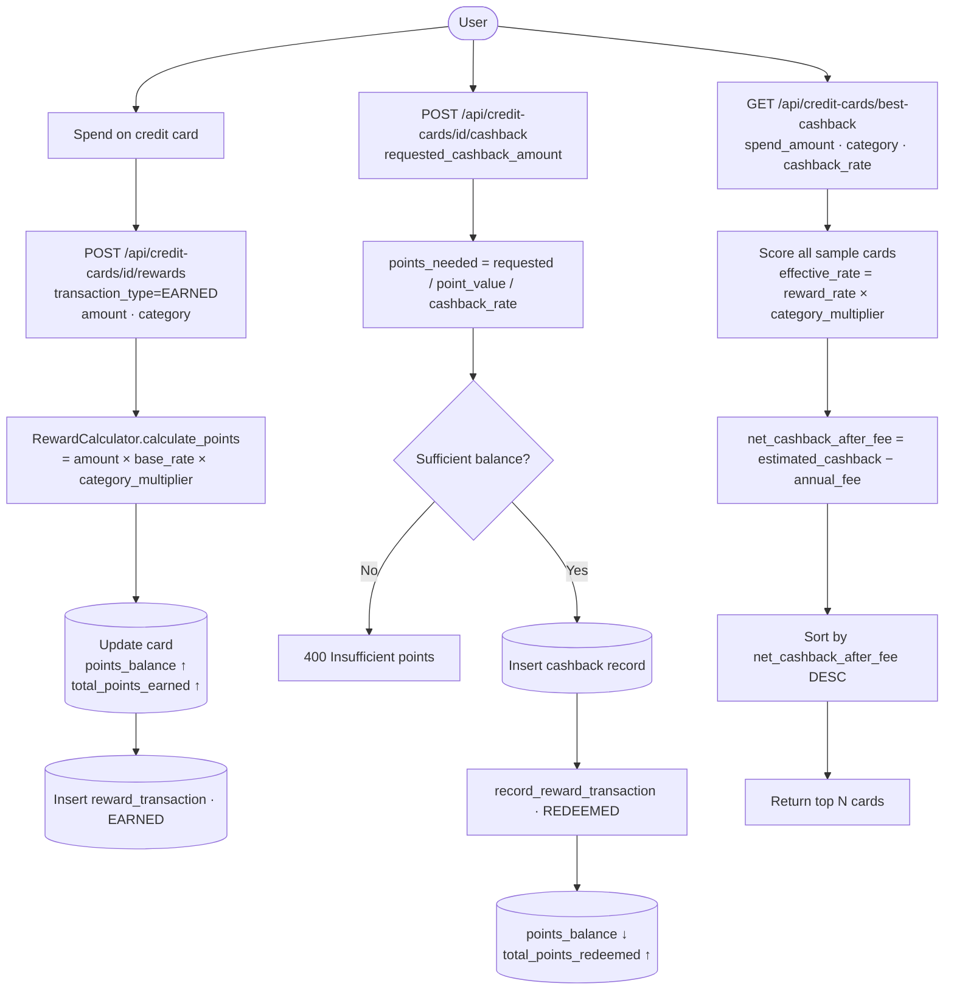
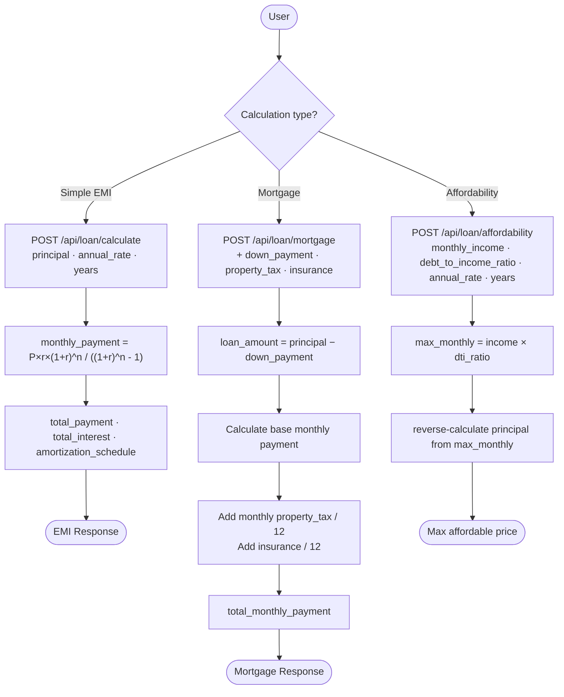
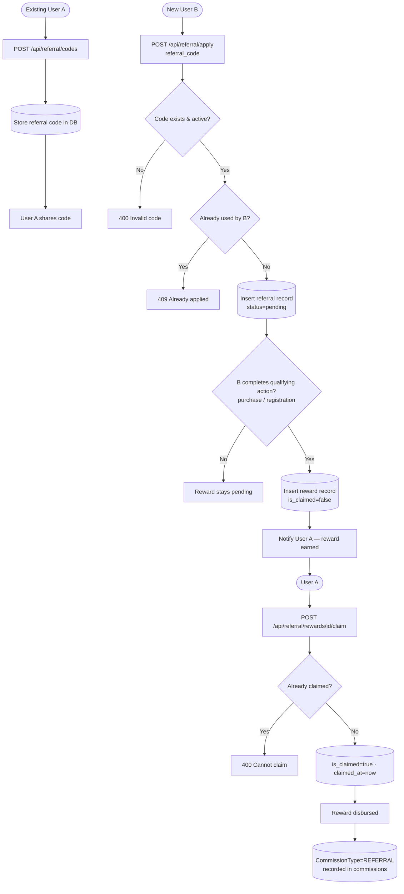

# Business Flow Charts — Housing Platform

> All diagrams use [Mermaid](https://mermaid.js.org/) syntax — renders on GitHub, GitLab, Notion, and VS Code with the Mermaid plugin.

---

## 1. User Authentication Flow

---

## 2. Property Listing Flow

---

## 3. Commission Calculation & Payout Flow

---

## 4. Reimbursement Lifecycle Flow

---

## 5. Claims Lifecycle Flow

---

## 6. Payroll Processing Flow (Full Integration)

---

## 7. Tax Computation Flow (Indian IT)

---

## 8. Credit Card Rewards & Cashback Flow

---

## 9. Loan Calculation Flow

---

## 10. Referral & Reward Claim Flow

